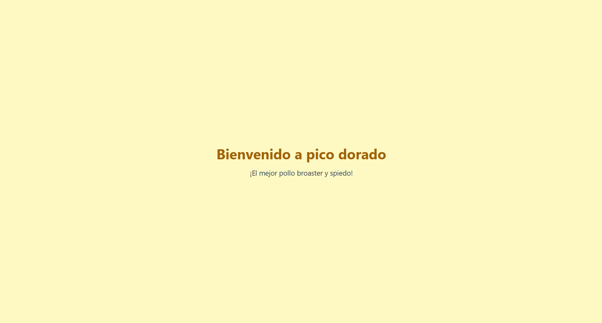
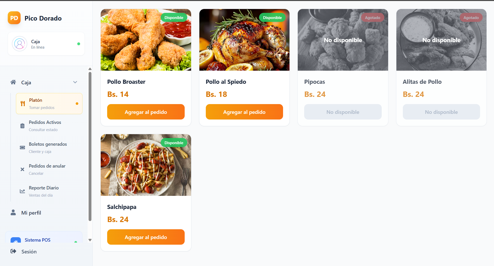
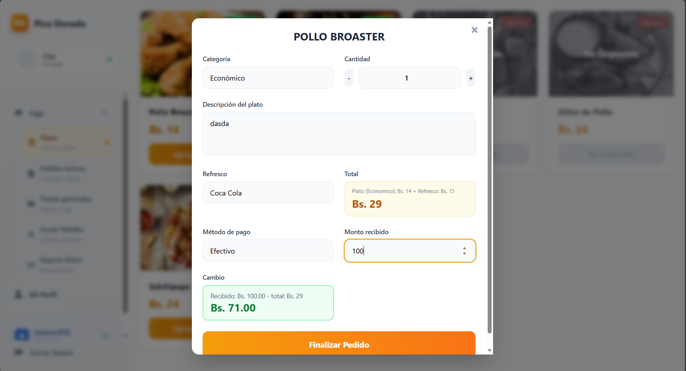
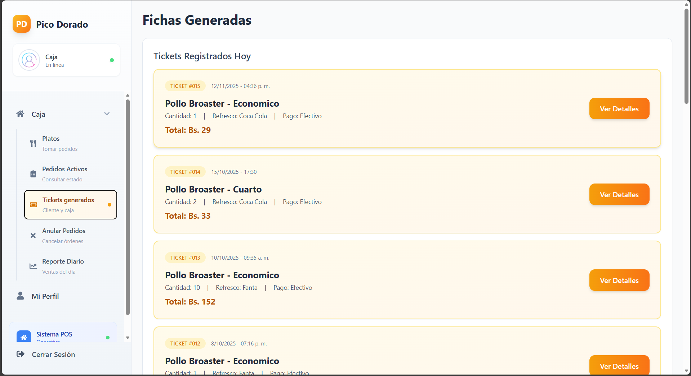
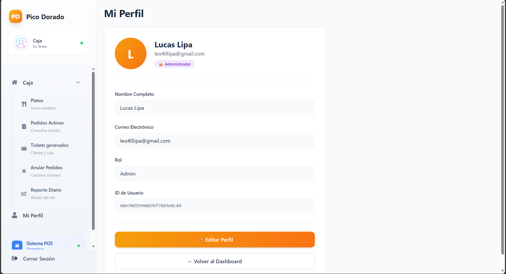
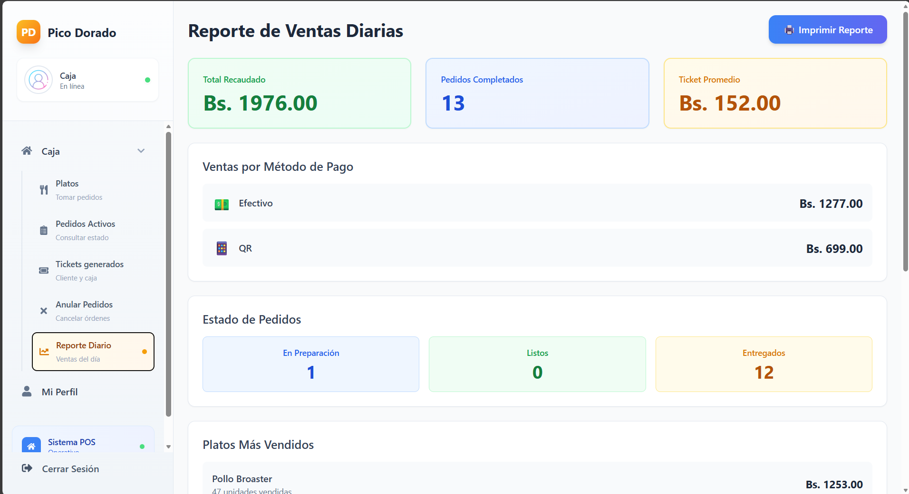
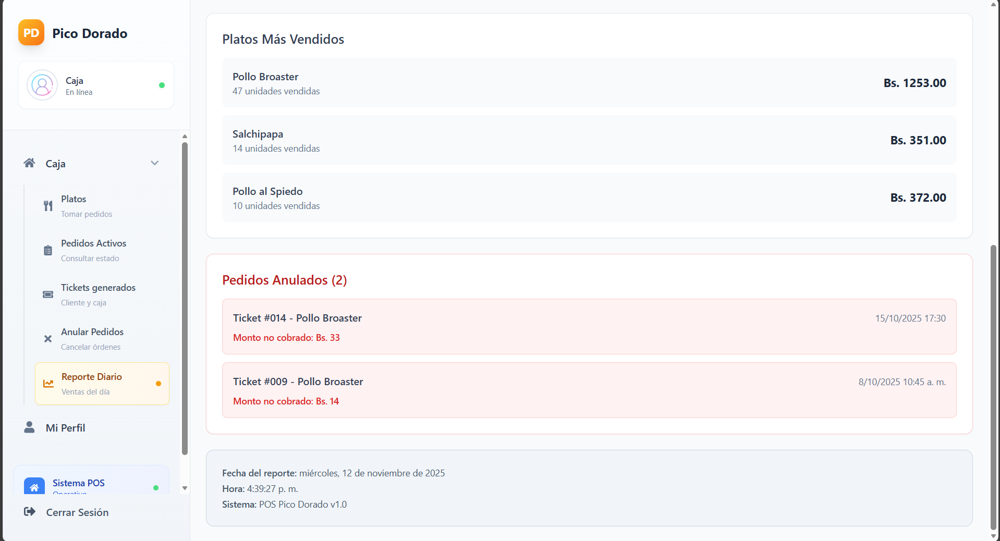

# 🍗 Pico Dorado - Frontend

<div align="center">



**Sistema POS (Punto de Venta) para restaurante de comida rápida especializado en pollo broaster**

[](https://react.dev)
[](https://www.typescriptlang.org/)
[](https://tailwindcss.com)
[](https://vitejs.dev)

</div>

---

## 📋 Tabla de Contenidos

- [Descripción](#-descripción)
- [Capturas de Pantalla](#-capturas-de-pantalla)
- [Características](#-características)
- [Tecnologías](#️-tecnologías)
- [Requisitos Previos](#️-requisitos-previos)
- [Instalación](#-instalación)
- [Configuración](#-configuración)
- [Uso](#-uso)
- [Estructura del Proyecto](#-estructura-del-proyecto)
- [Scripts Disponibles](#-scripts-disponibles)
- [Componentes Principales](#-componentes-principales)
- [Rutas](#️-rutas)
- [Integración con API](#-integración-con-api)
- [Estilos con Tailwind CSS](#-estilos-con-tailwind-css)
- [Despliegue](#-despliegue)
- [Solución de Problemas](#-solución-de-problemas)
- [Autores](#-autores)

---

## 📖 Descripción

**Pico Dorado Frontend** es la interfaz de usuario moderna y responsive del sistema POS diseñado para restaurantes de comida rápida especializados en pollo broaster. Construido con React 19, TypeScript y Tailwind CSS vía CDN, ofrece una experiencia fluida e intuitiva para la gestión diaria del restaurante.

### Funcionalidades Principales

- 🔐 Sistema de autenticación completo con JWT
- 📊 Dashboard interactivo con 5 secciones principales
- 🍽️ Gestión de pedidos en tiempo real
- 🎫 Sistema de tickets digital con numeración automática
- 💰 Registro de pagos con múltiples métodos
- 📈 Reportes y estadísticas diarias
- 👤 Gestión de perfiles de usuario
- 🔒 Rutas protegidas con autenticación JWT

---

## 📸 Capturas de Pantalla

### Login


### Dashboard


### Modal de Pedido


### Tickets


### Perfil


### Reporte Diario



---

## ✨ Características

### Autenticación y Seguridad

- ✅ Login con JWT (expiración: 7 días)
- ✅ Registro de usuarios con validación
- ✅ Recuperación de contraseña
- ✅ Rutas protegidas con ProtectedRoute
- ✅ Tokens en localStorage
- ✅ Interceptores Axios automáticos
- ✅ Redirección automática en token expirado

### Dashboard

- ✅ Sidebar navegable con 5 secciones
- ✅ Vista de Platos (catálogo de menú)
- ✅ Pedidos Activos (en tiempo real)
- ✅ Tickets Generados (historial completo)
- ✅ Anular Pedidos (con motivo)
- ✅ Reporte Diario (estadísticas)
- ✅ Responsive y colapsable en móvil
- ✅ Navbar con usuario, rol y logout

### Gestión de Pedidos

- ✅ Catálogo de platos con tarjetas visuales
- ✅ Categorías: Económico, Cuarto, Medio, Entero
- ✅ Modal con formulario completo
- ✅ Selección de cantidad y refresco
- ✅ Métodos de pago: Efectivo, QR, Tarjeta
- ✅ Cálculo automático de totales
- ✅ Validaciones en todos los campos

### Sistema de Tickets

- ✅ Numeración automática (#001, #002...)
- ✅ Estados: En Preparación, Listo, Entregado
- ✅ Cambio de estado con un clic
- ✅ Filtros y búsqueda en tiempo real
- ✅ Visualización clara con cards

### UI/UX

- ✅ Diseño moderno (paleta naranja/amarillo)
- ✅ Responsive (mobile, tablet, desktop)
- ✅ Animaciones suaves
- ✅ Loading states y feedback visual
- ✅ Iconos de React Icons + Flaticon

---

## 🛠️ Tecnologías

### Core

- **React** 19.1.1 - Librería de UI
- **TypeScript** 5.8.3 - Tipado estático
- **Vite** 7.1.2 - Build tool y dev server
- **React Router DOM** 7.9.4 - Enrutamiento del lado del cliente
- **Axios** 1.12.2 - Cliente HTTP para API
- **React Icons** 5.5.0 - Iconos para la interfaz

### Estilos

- **Tailwind CSS** (CDN) - Framework CSS utility-first
- **Flaticon UI Icons** 3.0.0 - Iconos adicionales

### Herramientas de Desarrollo

- **ESLint** 9.33.0 - Linter de código
- **TypeScript ESLint** 8.39.1 - Plugin TypeScript
- **Vite Plugin React** 5.0.0 - HMR y Fast Refresh

### Backend (Integración)

- **API REST** - `http://localhost:5000/api`
- **Autenticación** - JWT con expiración de 7 días
- **Base de datos** - MongoDB Atlas

---

## ⚙️ Requisitos Previos

- **Node.js** v18.0.0 o superior
- **npm** v9.0.0 o superior
- **Git** para control de versiones
- **Backend de Pico Dorado** corriendo en `http://localhost:5000`

### Verificar instalación
```bash
node --version   # v18.x.x o superior
npm --version    # v9.x.x o superior
git --version    # cualquier versión
```

---

## 📦 Instalación

### 1. Clonar el repositorio
```bash
git clone https://github.com/tu-usuario/pico-dorado-frontend.git
cd pico-dorado
```

### 2. Instalar dependencias
```bash
npm install
```

### 3. Iniciar servidor de desarrollo
```bash
npm run dev
```

### 4. Abrir en el navegador
```
http://localhost:5173
```

---

## 🔧 Configuración

### Variables de Entorno (Opcional)

Crear archivo `.env` en la raíz:
```env
VITE_API_URL=http://localhost:5000/api
```

### Tailwind CSS vía CDN

Configurado en `index.html`:
```html
<script src="https://cdn.tailwindcss.com"></script>
<link rel='stylesheet' href='https://cdn-uicons.flaticon.com/3.0.0/uicons-regular-rounded/css/uicons-regular-rounded.css'>
```

---

## 🎯 Uso

### Desarrollo
```bash
npm run dev
```

Servidor disponible en: `http://localhost:5173`

### Build para Producción
```bash
npm run build
```

Archivos generados en carpeta `dist/`

### Preview del Build
```bash
npm run preview
```

### Linting
```bash
npm run lint
```

---

## 📁 Estructura del Proyecto
```
pico-dorado/
├── src/
│   ├── assets/              # Imágenes y recursos
│   │   ├── fondo-login.png
│   │   ├── icono.png
│   │   ├── login.png
│   │   └── usuario.png
│   │
│   ├── components/          # Componentes reutilizables
│   │   ├── ModalPedido.tsx
│   │   ├── PedidoCard.tsx
│   │   ├── ProtectedRoute.tsx
│   │   ├── Sidebar.tsx
│   │   ├── TicketDetail.tsx
│   │   └── TicketList.tsx
│   │
│   ├── pages/               # Páginas principales
│   │   ├── Dashboard.tsx
│   │   ├── Home.tsx
│   │   ├── Login.tsx
│   │   ├── OrderCard.tsx
│   │   ├── Perfil.tsx
│   │   ├── RecuperarPassword.tsx
│   │   └── Registro.tsx
│   │
│   ├── services/            # Servicios de API
│   │   ├── api.ts
│   │   └── auth.ts
│   │
│   ├── App.tsx              # Componente raíz
│   ├── main.tsx             # Punto de entrada
│   └── vite-env.d.ts
│
├── public/                  # Archivos públicos
├── capturas/                # Capturas de pantalla
├── index.html               # HTML con Tailwind CDN
├── package.json
├── tsconfig.json
├── vite.config.ts
└── README.md
```

---

## 📜 Scripts Disponibles

| Script | Comando | Descripción |
|--------|---------|-------------|
| **Desarrollo** | `npm run dev` | Servidor de desarrollo con HMR |
| **Build** | `npm run build` | Compilar TypeScript y build de producción |
| **Preview** | `npm run preview` | Preview del build |
| **Lint** | `npm run lint` | Verificar código con ESLint |

---

## 🧩 Componentes Principales

### ProtectedRoute
Protege rutas que requieren autenticación. Verifica token y redirige a login si es necesario.

### ModalPedido
Modal para crear pedidos con selección de plato, cantidad, refresco y método de pago.

### Sidebar
Barra lateral con navegación entre las 5 secciones del dashboard.

### TicketList
Lista de tickets con filtros, búsqueda y acciones rápidas.

### TicketDetail
Detalle completo de un ticket individual con toda su información.

### PedidoCard
Tarjeta visual de plato con imagen, nombre, precio y botón de acción.

---

## 🗺️ Rutas

| Ruta | Componente | Protegida | Descripción |
|------|------------|-----------|-------------|
| `/` | Home | ❌ | Página de inicio |
| `/login` | Login | ❌ | Inicio de sesión |
| `/registro` | Registro | ❌ | Registro de usuario |
| `/recuperar-contraseña` | RecuperarPassword | ❌ | Recuperar contraseña |
| `/dashboard` | Dashboard | ✅ | Dashboard principal |
| `/perfil` | Perfil | ✅ | Perfil de usuario |

---

## 🔌 Integración con API

### URL Base
```typescript
const API_URL = 'http://localhost:5000/api';
```

### Servicios de Autenticación

- `login(email, password)` - Iniciar sesión
- `registrar(nombre, email, password, rol)` - Registrar usuario
- `obtenerPerfil()` - Obtener perfil
- `cerrarSesion()` - Cerrar sesión
- `estaAutenticado()` - Verificar autenticación

### Servicios de Tickets

- `crearTicket(ticketData)` - Crear ticket
- `obtenerTodosTickets()` - Listar todos
- `obtenerTicketsActivos()` - Listar activos
- `actualizarEstadoTicket(numero, estado)` - Cambiar estado
- `anularTicket(numero)` - Anular ticket
- `obtenerReporteDiario()` - Reporte del día

### Interceptores Axios
```typescript
// Agregar token automáticamente
axios.interceptors.request.use((config) => {
  const token = localStorage.getItem('token');
  if (token) config.headers.Authorization = `Bearer ${token}`;
  return config;
});

// Manejar errores 401
axios.interceptors.response.use(
  (response) => response,
  (error) => {
    if (error.response?.status === 401) {
      localStorage.removeItem('token');
      window.location.href = '/login';
    }
    return Promise.reject(error);
  }
);
```

---

## 🎨 Estilos con Tailwind CSS

### Configuración CDN

Tailwind CSS está cargado vía CDN en `index.html`:
```html
<script src="https://cdn.tailwindcss.com"></script>
```

### Paleta de Colores

- **Naranja**: `#FF8C00` (from-amber-500, to-orange-500)
- **Amarillo**: `#FFD700` (amber-400)
- **Gris**: Escala de slate (50-900)

### Clases Comunes
```tsx
// Gradientes
className="bg-gradient-to-r from-amber-500 to-orange-500"

// Botones
className="px-6 py-3 bg-orange-500 text-white rounded-lg hover:bg-orange-600"

// Cards
className="bg-white rounded-xl shadow-md p-6"

// Responsive
className="grid grid-cols-1 md:grid-cols-2 lg:grid-cols-3 gap-4"
```

---

## 🚀 Despliegue

### Opción 1: Vercel
```bash
npm install -g vercel
vercel
```

### Opción 2: Netlify
```bash
npm run build
# Subir carpeta dist/ manualmente
```

### Opción 3: GitHub Pages

Agregar en `vite.config.ts`:
```typescript
export default defineConfig({
  base: '/pico-dorado/',
  // ...
})
```

---

## 🔧 Solución de Problemas

### Error: "Cannot connect to backend"

**Causa:** Backend no está corriendo  
**Solución:** Iniciar backend en `http://localhost:5000`
```bash
cd pico-dorado-backend
npm run dev
```

### Error: "401 Unauthorized"

**Causa:** Token expirado o inválido  
**Solución:** Hacer login nuevamente

### Error: "Module not found"

**Causa:** Dependencias no instaladas  
**Solución:**
```bash
rm -rf node_modules package-lock.json
npm install
```

### Tailwind no funciona

**Causa:** CDN no cargado  
**Solución:** Verificar `index.html` tenga el script de Tailwind

---

## 👥 Autores

- **Lucas Lipa Matta** - Full Stack
- **Jose Enrique Martinez Rojas** - Desarrollador Backen y Database
- **Jorge Chipana Flores** - Desarrollador Fronted

Proyecto: Sistema POS Pico Dorado
Fecha: Octubre 2025
Universidad: Universidad Amazónica de Bolivia

## 📄 Licencia
Este proyecto es de uso académico.

## 🙏 Agradecimientos

- Profesor de la asignatura: ING. Victor Hugo SARZURI FLORES
- Compañeros de clase
- Documentación oficial de React, TypeScript y Tailwind CSS